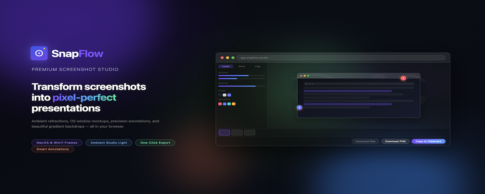
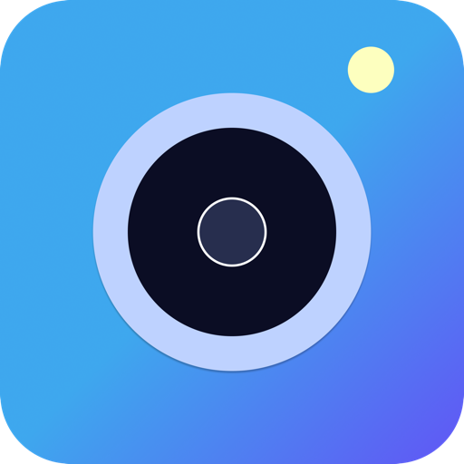
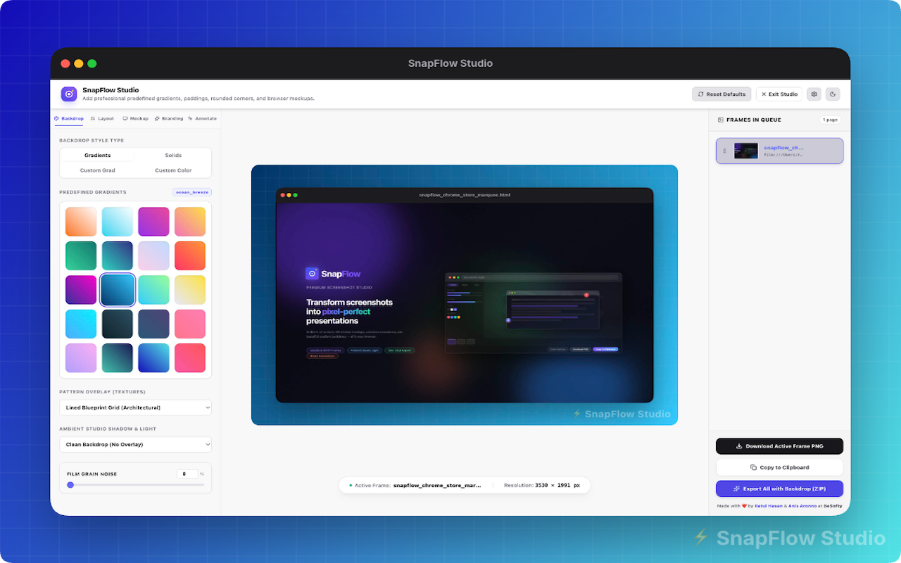
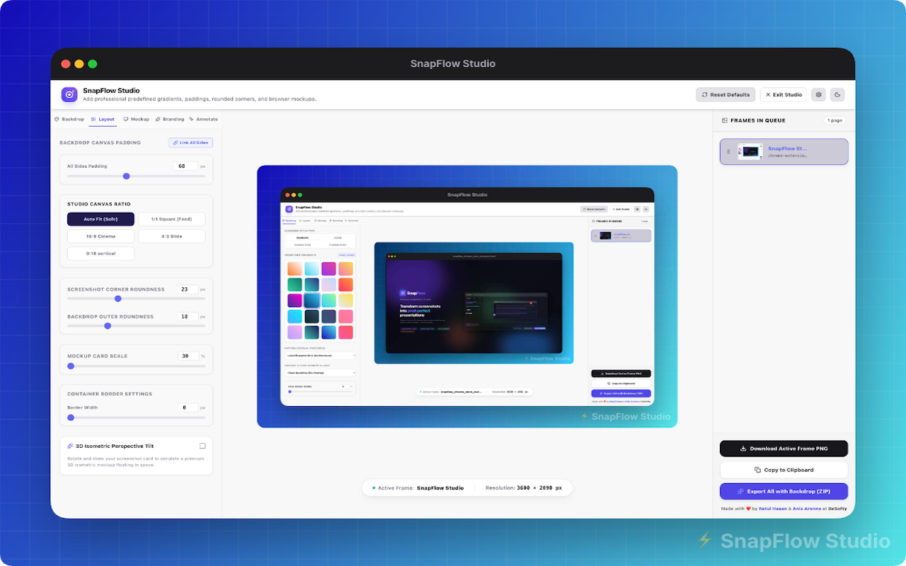
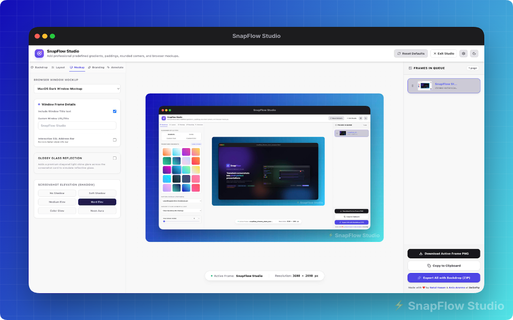
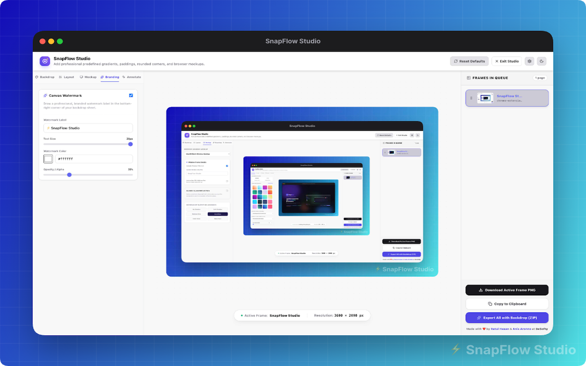
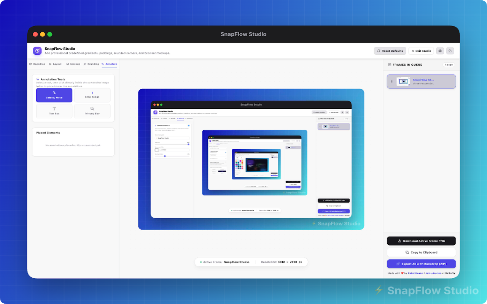

# SnapFlow Studio 📸

<p align="center">
  
</p>

<p align="center">
  
</p>

<h1 align="center">⚡ SnapFlow Studio</h1>

<p align="center">
  <strong>The Ultra-Premium Workflow Screenshot Studio for Chrome, Edge, Firefox, Brave, and Safari.</strong>
</p>

<p align="center">
  <a href="https://buymeacoffee.com/ratulhasan"></a>
  
  
</p>

---

## 🌟 Introduction

**SnapFlow Studio** is a professional, high-fidelity browser extension designed for designers, developers, and product managers who need pixel-perfect screenshot mockups, rapid annotations, and beautiful ambient presentations in seconds.

Whether you need to capture a full scrollable page, wrap it in a sleek macOS window mockup, overlay organic branch shadows, blur sensitive API keys, or stamp discount coupons on a banner, SnapFlow Studio is the ultimate workspace.

---

## 🎨 Interactive Studio Showcase

Our high-fidelity HTML5 Canvas editor provides five visual design stages to style, mock up, and annotate your screenshots.

### 🌌 1. Premium Backdrop System
Choose from dozens of curated mesh gradients, custom gradients, or solid colors. Adjust canvas padding, aspect ratios (16:9, 4:3, 1:1, or auto), and add a subtle studio noise texture to eliminate color banding.
<p align="center">
  
</p>

### 📐 2. Flexible Layout Alignments
Adjust mockup padding, vertical/horizontal off-centering, border sizes, and colors. Crop your screenshots on the fly and watch the mockup automatically adapt and re-wrap.
<p align="center">
  
</p>

### 💻 3. OS Window Mockup Frames
Wrap screenshots in macOS (Light, Dark, Glass Outline) or Windows 11 (Light, Dark) mockups. Scale mockup controls, traffic lights, and window headers dynamically without pixelation.
<p align="center">
  
</p>

### 🏷️ 4. Visual Branding & Custom Watermarks
Add your custom brand logo text in 5 positions (Top-Left, Top-Right, Center, Bottom-Left, Bottom-Right). The SnapFlow Studio brand mark automatically mirrors in the opposite corner to keep your canvas uncluttered.
<p align="center">
  
</p>

### ✏️ 5. Designer Annotation & Drawing Tools
A full non-destructive annotation layer drawn via HTML5 Canvas — everything renders at full resolution on export.

**Classic annotations**
*   **Step Numbers:** Auto-incrementing numbered badges for tutorials and walkthroughs.
*   **Redaction Blur:** Securely blur API keys, emails, and other sensitive data.
*   **Text Boxes:** Five designer presets — Plain, Badge, Coupon, Flyer, Callout. Customize width, padding, margins, radius, color, and font size.

**Drawing tools**
*   **Pen:** Freehand draw directly on the screenshot.
*   **Rectangle, Circle:** Filled or outlined shapes with custom stroke and fill color.
*   **Line, Arrow:** Straight lines and arrowheads for callouts and flow diagrams.
*   **Highlight:** Semi-transparent freehand brush to emphasize any area.

**Spotlight / Zoom**
*   Drop a circular magnifier on any part of the screenshot.
*   Control circle size and zoom level (1.5×–5×) independently via sliders.
*   Drag to reposition. Renders in full resolution on export.

**Undo / Redo**
*   Full history stack — `Ctrl+Z` / `Ctrl+Y` or toolbar buttons.

<p align="center">
  
</p>

---

## ⚡ Keyboard Shortcuts

| Shortcut | Action |
| :--- | :--- |
| **`Ctrl+Shift+3`** | Capture Visible Viewport |
| **`Ctrl+Shift+4`** | Capture Full Scrollable Page |
| **`Ctrl+Shift+F`** | Open SnapFlow Studio Popup |
| **`Ctrl+Z`** | Undo last annotation |
| **`Ctrl+Y`** | Redo |

---

## 📦 Export Options

1. **Copy to Clipboard:** High-res PNG blob — paste instantly into Notion, Slack, Figma, or Discord.
2. **Download Mockup:** Finalized composition with background, frames, and annotations.
3. **Export All as ZIP:** Batch pack all screenshots into a single ZIP file.
4. **Download Raw:** Original un-edited screenshot saved directly to downloads.

---

## 🚀 Installation & Local Development

### Prerequisites
- **Node.js** (v18 or higher)
- **npm** or **pnpm** package manager

### Development Server
```bash
# Install dependencies
npm install

# Start the Plasmo local development server
npm run dev
```

1. Open your browser and navigate to the Extensions management page (`chrome://extensions` or `edge://extensions`).
2. Enable **Developer Mode** (toggle in the top-right corner).
3. Click **Load unpacked** and select the `build/chrome-mv3-dev` directory.

### Production Compilations
```bash
# Build for Google Chrome
npm run build

# Build for Mozilla Firefox (MV2)
npm run build:firefox

# Build for all target browsers (Chrome, Edge, Firefox, Safari, Brave)
npm run build:all
```
Completed packages are compiled into ZIP archives inside the root project directory.

---

## 🌐 Browser Compatibility

| Browser | Manifest Version | Status |
| :--- | :---: | :---: |
| **Google Chrome** | MV3 | ✅ Supported |
| **Microsoft Edge** | MV3 | ✅ Supported |
| **Brave Browser** | MV3 | ✅ Supported |
| **Mozilla Firefox** | MV2 | ✅ Supported |
| **Apple Safari** | MV3 | ✅ Supported |

---

## ☕ Support & Interceptors

If SnapFlow Studio makes your documentation and design workflows faster, support the development!

**[Support the Developer on Buy Me A Coffee ☕](https://buymeacoffee.com/ratulhasan)**

---

## 📄 License

Distributed under the MIT License. Created by [Ratul Hasan](https://ratulhasan.com).
